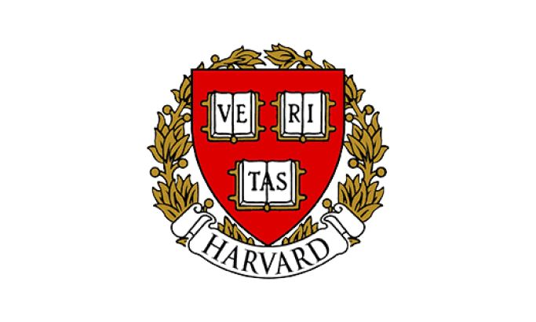
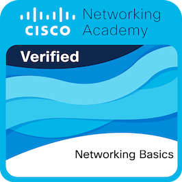

> [!NOTE]
> **Full-Stack Developer mit Architektur-Fokus:** Mein Fokus liegt auf performanten Web-Applikationen mit modernem API-Design und  UI/UX-Details - gestützt auf automatisierte Deployment-Prozesse, Container-Orchestrierung
> (Docker) und Sicherer System-Architektur.


###  Bildung & Aktueller Fokus
*  **HTL Pinkafeld:** Abschlussjahr für **Informatik (Computer Science)**.
*  **Architektur & Full-Stack:** Fokus auf **JavaScript** (Frontend & Backend), Netzwerktechnik **Cisco**, sowie Datenbanken **Oracle**, **SQLite** und **PostgreSQL**.
*  **Zertifizierung:** Harvard **CS50x** & **Cisco CCNA**.
*  **Methodik & Workflow:** Fortgeschrittene Projektsteuerung mit Jira und Git.

*  **Interessen & Vertiefung:**
    * [ ] Architektur System- & Software-Design (Skalierbarkeit & Effizienz)
    * [ ] Moderne Webentwicklung & agiler Workflow (Full-Stack)
    * [ ] Fortgeschrittene Konzepte bei der Netzwerktechnik
    * [ ] Organisation und Planung
    * [ ] Performance-Optimierung & Refactoring bestehender Systeme
    * [ ] Lösungsorientierte Ansätze zur Prozessoptimierung


---

###  Tech Stack & Tools
<p align="left">
  
  
  
  <br>
   
  
  
  <br>
   
  
   <br>
  
</p>

---

###  Home Lab & Autodidaktische Projekte
Neben der Schule brenne ich für das "Basteln" an eigenen Systemen. Das hat mir ein tiefes Verständnis für Linux und Containerisierung vermittelt:
*  **Self-Hosting:** Verwaltung eines Home-Media-Servers mittels **OMV** und **Plex** via **Docker** und **Portainer**. **[Pi-hole inklusive]**.
*  **Hardware:** Erfahrung mit **Raspberry Pi**, **Arduino** & **Dell-Optiplex**.
*  **DevOps Basics:** Sicherer Umgang mit Git, GitHub Workflows und Linux-Umgebungen.

---

###  Über mich
Ich bin leidenschaftlich daran interessiert, **reale Problemstellungen** durch digitale Möglichkeiten zu lösen.

* **Analytisches Denken:** Ich liebe es, bestehende Prozesse zu analysieren und zu optimieren, um die Wartbarkeit und Usability zu erhöhen (DRY, SoC).
* **Arbeitsweise:** Agil, mit fokus auf Clean Code & Dokumentation. Ich nutze **Jira** aktiv zur Strukturierung, Organisierung und Aufgabenteilung (Scrum/Kanban).
* **Lösungsorientierung:** Egal ob Oldschool oder neue Technologien – für mich steht das Ergebnis und die User-Experience im Vordergrund.
* **Werte:** Sicherheit (Security-by-Design), saubere Dokumentation und ein hoher Anspruch an die Code-Qualität sind für mich Standard.
* **Sprachen & Kultur:**
   * **Deutsch:** Muttersprache
   * **Englisch:** Matura-Niveau
   * **Sprachaffinität:** Ich interessiere mich für Sprachen, um neue Perspektiven zu gewinnen.
   *    *Spanisch, Italienisch, Französisch:* Fokus auf Basics & interkulturelles Verständnis
   *    *Japanisch:* Grundkenntnisse (VHS A1) aus persönlichem Interesse.
     
  <br>

  > *"Education isn't something you can finish"* - Isaac Asimov


*  **Zusammenarbeit:** Ich suche den Austausch mit Gleichgesinnten, sei es in Open-Source-Projekten oder als Lern-Buddy.
*  **Dialog:** Ich schätze semantische Gespräche, die die grauen Zellen anregen und neue Perspektiven eröffnen.

---

##  Zertifizierungen

<table>

  <tr>
    <td width="100px" align="center">
     
    </td>
    <td>
      <strong>CS50's Introduction to Computer Science</strong><br>
      Harvard University (via edX) • 2025<br>
      <a href="assets/CS50x_certificate.pdf">
        
      </a>
    </td>
  </tr>

<tr>
    <td width="100px" align="center">
      
    </td>
    <td>
      <strong>CCNA: Introduction to Networks</strong><br>
      Cisco Networking Academy • 2025<br>
      <a href="assets/CCNA_Introduction_to_Networks.pdf">
        
      </a>
    </td>
  </tr>

 <tr>
    <td width="100px" align="center">
      
    </td>
    <td>
      <strong>Networking Basics</strong><br>
      Cisco Networking Academy • 2025<br>
      <a href="assets/Networking_Basics_certificate_lukas.pdf">
        
      </a>
    </td>
  </tr>
  
</table>


---

###  Quick Facts
* **Fokus:** Full-Stack Development, API-Design & Systemarchitektur
* **Tools:** Visual Studio Code, Git, GitHub, Docker, Linux, Jira
* **Fun Fact:** Guter Code ist wie ein guter Witz: Musst du ihn erklären, ist er schlecht.

````mermaid

timeline
    title   Von der ersten Bash-Zeile zur System-Architektur
    2022/23 :  Einstieg : HTL Pinkafeld Start <br> Linux Basics & Bash Scripting <br> Erste Algorithmen <br> : Beginn mit Maturafächern DE / EN / AM 
    2023/24 :  Fundament : Cisco CCNA (Netzwerktechnik) : <br> SQL Datenbanken (Oracle) : <br>  Einführung OOP & Web-Entwicklung (HTML, CSS, JS)
    2024/25 :  Spezialisierung : Full-Stack Development (Node.js) : <br> Versionsverwaltung (Git) : <br> Agiles Projektmanagement (Jira) : <br>  Containerisierung (Docker)
    2025/26 :  Abschlussjahr : <br> Matura DE / EN / AM : Diplomarbeit (Abschluss) <br> Reife- & Diplomprüfung : <br> Fokus System-Architektur : <br> Technische-Matura NVS / DBI / SYP

````

<!---
Nob101/Nob101 is a  special  repository because its `README.md` (this file) appears on your GitHub profile.
You can click the Preview link to take a look at your changes.
--->
